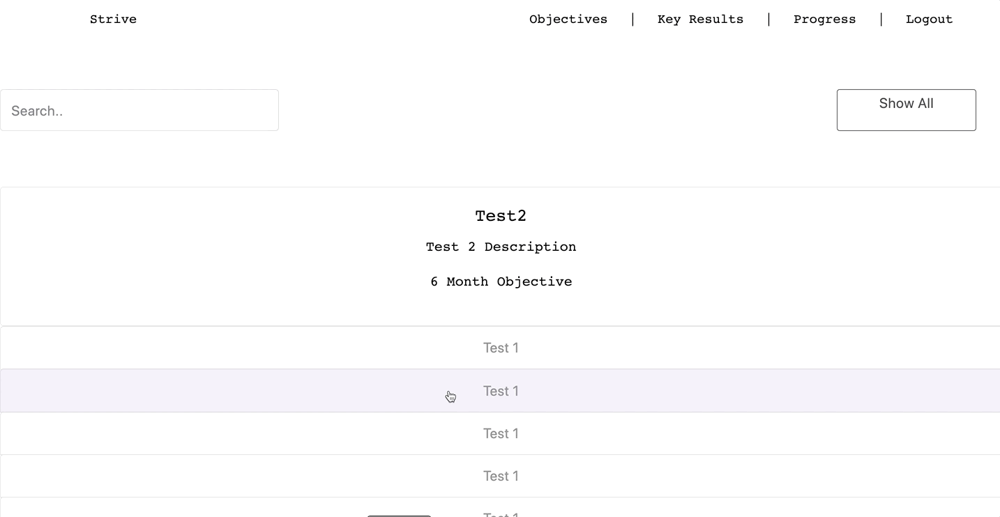

# Strive
- Strive is an online goal setting management system inspired by OKR's.
- The aim is to help companies and indivisuals achieve their goals by setting objectives, key results, and by providing visual progress trackers.

### Previews
#### User Login and User Homepage

- Application persist users and user data specific to each user
- On correct log in application renders a stack of quotes, shuffled on refresh
- Allows users to create objectives and key results that will be persisted in the database
- Stores 3 objectives on main objective screen and others are store at "Show All Objectives"

#### Key Results and Task Addition

- Key Results stores each users 5 key results to each objective correctly (3 Minimum)
- Allows for user to add task to each key result and persist task storing it with it's key result
- Effeciently searches through the user's objectives and returns the correct match

#### Objective Progress and Logout

- Upon Completion of a key result, user will be redirected to the progress page where each completed key result will add 25% to the overall objective progress
- Persist and stores data in a visual progress tracker tailored to each objective and to each user 
- Effectively stores data after log out and displays data on logout

### Technologies Used 
- Front-End
    - Webpack and Babel Configuration Files
    - Front-End Developed with React 
    - React Router for front-end routing
    - Styled Components
    - Inline CSS
    - HTTP request made to server using axios

- Back-End
    - Express Server
    - MySQL Database 
        - Sequelize 
        - Raw SQL

